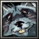
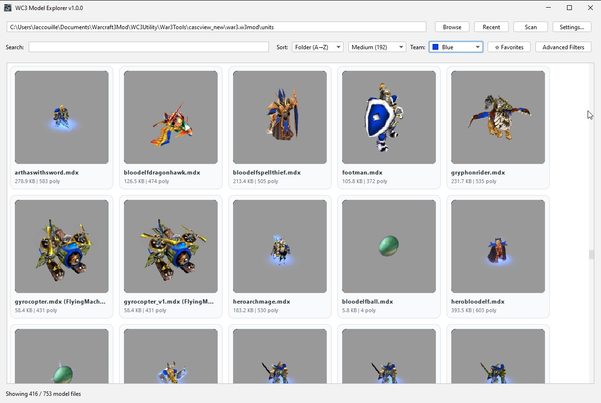
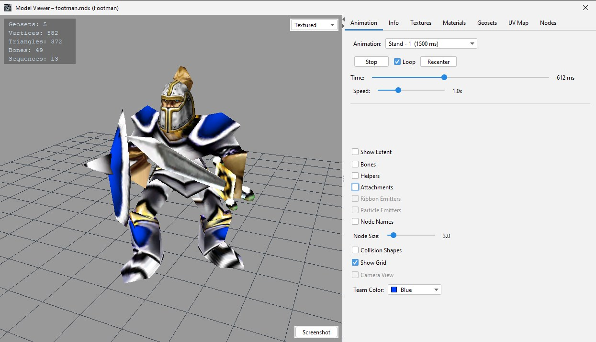

# WC3 Model Explorer

<p align="center">
  
</p>

A desktop application for browsing, previewing, and inspecting Warcraft III model files (MDX/MDL, no HD).

Scan directories or map archives, view 3D thumbnails, and explore model internals — geometry, textures, animations, bones.



### Supported Formats

- **Model files:** MDX (versions 800–1200), MDL. Reforged HD models are not supported.
- **Map archives:** `.w3x` / `.w3m` — both Reforged and pre-Reforged (MPQ) map formats.

## Features

### Model Browser

- Recursive scanning of directories and map archives (`.w3x`, `.w3m`)
- Animated 3D thumbnail grid with configurable size (128–352px) and render quality
- Real-time search by filename or internal model name
- Sort by name, file size, or parent folder
- Favorites and recent folders tracking
- Advanced filters: animation name, texture path, polygon range, file size range, portrait filter
- Team color selector for thumbnails (25 colors)
- Right-click context menu: copy path/file, open in explorer, open in external program, manage tags
- Drag & drop models to external applications

### Tagging

- Auto-extracted tags from `readme.html` files placed in a model's folder (or its parent), parsing lines like `Tags: Hero, Unit, Historic`
- Per-model custom tags added via the right-click **Tags** submenu
- Tri-state tag filter buttons — click to cycle **Neutral → Include → Exclude** to require or hide models with a given tag
- Hide unwanted tags from the filter bar via **Settings > Tags**, with a one-click restore for previously hidden tags
- Auto-extraction can be toggled off entirely in settings if you prefer purely manual tagging

### 3D Model Viewer



- Orbit, pan, and zoom camera with mouse controls
- 6 shading modes: Solid, Textured, Lit, Normals, Geoset Colors, Bone Count heat map
- Wireframe toggle
- Animation playback with sequence selector, play/pause, loop, speed control (0.1x–3x), and timeline scrubber
- Overlay toggles: extents, bones, helpers, attachments, ribbon emitters, particle emitters, collision shapes, node names, grid
- Screenshot export to PNG
- On-screen stats HUD (geosets, vertices, triangles, bones, sequences)

### Model Inspection Tabs

- **Animation** — sequence list, scrubber, speed, loop, recenter
- **Info** — file name, model name, path, size, vertex/polygon/bone/geoset/sequence/texture counts, bounding radius
- **Textures** — texture list with source indicator (CASC/MPQ/disk), hover preview, zoom/pan popup
- **Materials** — material layers with filter modes and geoset associations
- **Geosets** — per-geoset vertex count, material, filter mode; click to highlight in 3D
- **UV Map** — per-geoset/layer UV visualization with wireframe and alpha toggles
- **Nodes** — bone tree hierarchy; click to highlight in 3D

### Data Sources

- **CASC** — automatic detection of Warcraft III Reforged installations
- **MPQ** — classic archive support (multiple archives)
- **Disk** — direct file system access

### Texture Formats

BLP, DDS, TGA, PNG, JPEG

### Settings

- Theme selection (Metal, Nimbus, System, FlatLaf Light/Dark/IntelliJ/Darcula, and more)
- Language: English, French
- Camera angle presets (yaw/pitch) with live 3D preview
- Thumbnail animation pose and render quality
- 3D background color picker
- External program configuration with `{file}` placeholder
- Tag parsing toggle and hidden-tag management

## Usage

### Browsing Models

1. Click **Browse** and select a folder containing `.mdx` / `.mdl` files, or drop a map archive (`.w3x`, `.w3m`) onto the window.
2. The application scans the directory recursively and displays animated 3D thumbnails.
3. Use the search bar, sort dropdown, or advanced filters to narrow results.
4. Click a thumbnail to open the 3D model viewer.

### Configuring Data Sources

Models often reference textures stored in Warcraft III game archives. To load these textures, configure a CASC or MPQ source in **Settings > Data Sources**.

#### CASC (Warcraft III Reforged)

1. Open **Settings**.
2. In the **CASC Archive** section, click **Browse**.
3. Select your Warcraft III installation folder — the one that contains the `_retail_` or `Data` sub-folder.
   Typical path: `C:\Program Files (x86)\Warcraft III`
4. The application will automatically detect and open the CASC storage.

#### MPQ (Classic Warcraft III)

1. Open **Settings**.
2. In the **MPQ Archives** section, click **Add**.
3. Select one or more `.mpq` files (e.g. `war3.mpq`, `war3x.mpq`, `war3patch.mpq`).
4. Multiple archives can be added — they are searched in order when resolving textures.

Once a data source is configured, thumbnails and the 3D viewer will display textures from the game archives automatically.

## Building

Requires **JDK 17+**.

```bash
./gradlew build
```

### Run from source

```bash
./gradlew run
```

### Package as standalone application

Creates a self-contained application image with a bundled JRE (no Java installation required):

```bash
# App image (portable folder with .exe / binary)
./gradlew jpackageImage
# Output: build/jpackage/WC3ModelExplorer/

# Installer (.exe on Windows, .dmg on macOS, .deb on Linux)
./gradlew jpackage
```

## Keyboard Shortcuts

| Shortcut | Context | Action |
|----------|---------|--------|
| Arrow keys | Model browser | Navigate thumbnails |
| Enter | Model browser | Open selected model |
| Left / Up | Model viewer | Previous animation sequence |
| Right / Down | Model viewer | Next animation sequence |

## Dependencies

- [LWJGL 3](https://www.lwjgl.org/) — OpenGL rendering
- [FlatLaf](https://www.formdev.com/flatlaf/) — modern Swing look and feel
- [Reteras Model Studio](https://github.com/Retera/ReterasModelStudio) — MDX/MDL parsing
- [JMPQ3](https://github.com/inwc3/JMPQ3) — MPQ archive support
- [JCASC](https://github.com/DrSuperGood/JCASC) — CASC archive support
- [Java BLP ImageIO Plugin](https://github.com/DrSuperGood/blp-iio-plugin/tree/master) — BLP texture support
- [Java DDS ImageIO Plugin](https://github.com/GoldenGnu/) — DDS texture support

## License

See [LICENSE](LICENSE) for details.
